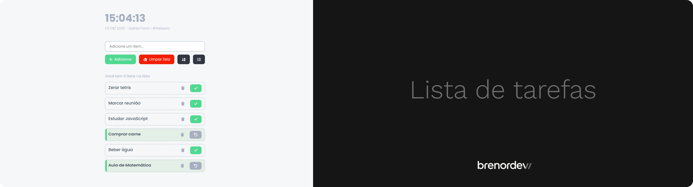

## Sobre o projeto

Este projeto foi iniciado durante estudos de JavaScript e por um tempo ficou sem atualização, durante o curso de **Desenvolvedor Full Stack Júnior** da [+praTi](https://maisprati.com.br/) & [codifica](https://www.codificaedu.com.br/) no módulo Front End e nas aulas de JavaScript sobre DOM e eventos foi dado como atividade para aplicação do conteúdo a criação de um to do list, foi dado como atividade extra marcar item como concluído, filtro em ordem alfabética/concluídos e contador de itens adicionados na lista. E como o projeto não estava finalizado sem nenhuma funcionalidade real de um to do list, resolvi retornar com o projeto e por em prática o conteúdo das aulas.

## Utilidade do projeto

Aplicação web de lista de tarefas para organização de atividades diárias e para lembretes de atividades futuras, possuindo também um visualizador para data e hora do usuário.

## 🔗 Link do Projeto

[Acesse o projeto online](https://todolist.brenordev.com.br/)

### Stack Utilizadas

  
  
  
  

